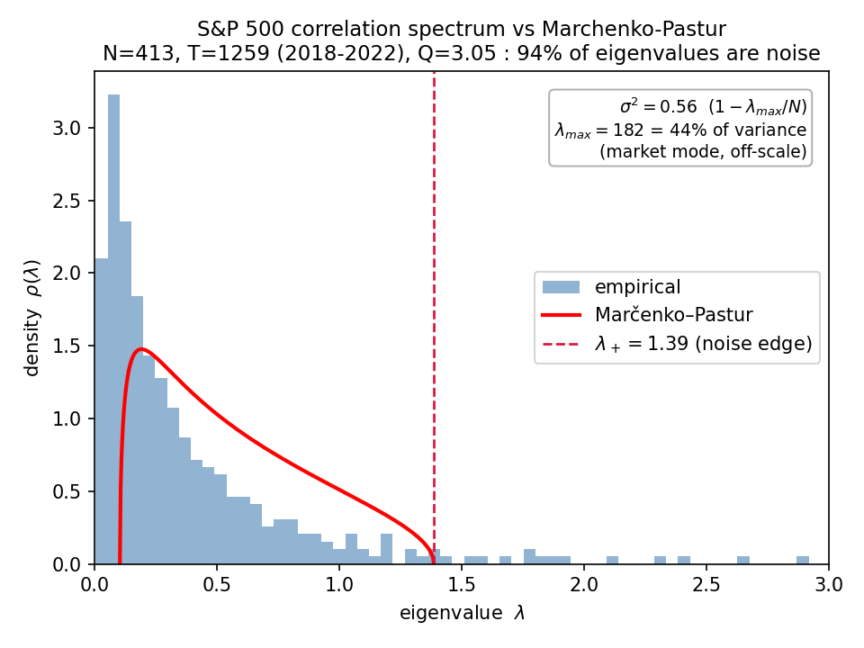

# rmtool_py

**A symbolic free-probability calculator for Python — give it distributions, get back exact spectra.**

<!-- Badges (wired up as they land): -->
<!--  -->
<!--  -->
<!--  -->

`rmtool_py` treats a spectral distribution as a first-class algebraic object: a
limiting eigenvalue law is carried as the bivariate polynomial that *defines*
it, so free convolution becomes algebra and densities and moments come out
**exact — no Monte Carlo, no sampling noise**. You can add (⊞), multiply (⊠),
invert, and deform distributions, then extract their density on a grid or their
moments as exact rationals.

The polynomial method for random matrices was introduced by **N. Raj Rao and
Alan Edelman**, whose [RMTool](https://www.mit.edu/~raj/) (MATLAB) first turned
it into a practical computational tool — a genuinely powerful idea: represent a
spectral distribution by the bivariate polynomial that defines it, and reduce
free convolution to algebra. `rmtool_py` builds directly on that foundation.
Its aim is not to replace RMTool but to **carry the method into the Python
scientific ecosystem** (NumPy / SciPy / SymPy / Jupyter), so that a broader
community — researchers, students, and practitioners across finance, statistics,
machine learning, and signal processing — can reach for it. We see this as
continuing and complementing Rao and Edelman's work, and we are grateful for the
foundation they laid.

## Install

```bash
git clone https://github.com/Jeanjacob20/RMT.git
cd RMT
pip install -e ".[dev]"      # editable install, with pytest
```

Requires Python 3.8+ (NumPy, SciPy, SymPy, Matplotlib are pulled in automatically).
<!-- Once published: pip install rmtool_py -->

## Quickstart

Distributions are objects you can do algebra on, and every answer is exact:

```python
import sympy as sp
from rmtool_py import AlgebraicMeasure as AM

sc = AM.wigner()                                 # semicircle (Wigner) law
mp = AM.marchenko_pastur(sp.Rational(1, 2))      # Marčenko–Pastur, ratio c = 1/2

# Free additive convolution — computed symbolically, never sampled:
free_sum = sc + sc
print(free_sum.lmz.canonical_form())   # 2*m**2 + m*z + 1   (a variance-2 semicircle)

# Moments come out as exact rationals:
print(sc.moments(8))   # [0, 1, 0, 2, 0, 5, 0, 14]  -> the even moments are Catalan numbers
print(mp.moments(4))   # [1, 3/2, 11/4, 45/8]
```

### The exact density *is* the limiting spectrum

Because the density is an algebraic curve rather than a histogram, it lands
exactly on the empirical spectrum of a large random matrix — and the package
ships the samplers to prove it:

```python
import numpy as np
import matplotlib.pyplot as plt
from rmtool_py import AlgebraicMeasure as AM
from rmtool_py.matrices import RandomMatrixGenerator as RMG

# One 3000x3000 GOE draw and its empirical eigenvalues:
A = RMG.generate_goe(p=3000, seed=0)
empirical = np.linalg.eigvalsh(A)

# The EXACT limiting density, computed symbolically — no sampling:
grid = np.linspace(-2, 2, 400)
rho = AM.wigner().density(grid).density

plt.hist(empirical, bins=80, density=True, alpha=0.4, label="GOE eigenvalues (N=3000)")
plt.plot(grid, rho, lw=2, label="rmtool_py exact density")
plt.legend(); plt.show()
```

The symbolic curve matches the Monte-Carlo histogram across the whole bulk
(to within histogram binning error) — but it was computed once, exactly, with no
sampling.

### Flagship application: noise-dressing of the S&P 500

The finance layer (`rmtool_py.finance`) applies the same theory to **real market
data**, reproducing Laloux–Cizeau–Bouchaud–Potters' *"Noise Dressing of Financial
Correlation Matrices"* (1999). On 413 stocks continuously in the S&P 500, daily
returns 2018–2022 (CRSP via WRDS; **N = 413, T = 1259, Q = 3.05** — essentially
the original paper's setup), the package fits the empirical correlation spectrum
to Marčenko–Pastur and separates signal from noise:



```python
import numpy as np
from rmtool_py.finance import correlation_matrix, fit_marchenko_pastur, information_eigenvalues, mp_edges

corr = correlation_matrix(returns, standardize=True)   # returns: N×T daily panel
eigs = np.linalg.eigvalsh(corr.C)
fit  = fit_marchenko_pastur(eigs, corr.Q)              # σ² = 1 − λ_max/N = 0.56
_, lam_plus = mp_edges(corr.Q, fit.sigma2_market)      # noise edge λ₊ = 1.39
info = information_eigenvalues(eigs, lam_plus)         # the few "signal" modes
```

**The result:** the largest eigenvalue (the *market mode*) alone carries **44% of
total variance**, while **94% of all eigenvalues (387/413) fall inside the
Marčenko–Pastur noise band** — statistically indistinguishable from a random
matrix. Only ~26 eigenvalues carry genuine signal: the market plus a handful of
sector/factor structures. This is the estimation noise that corrupts naïve
mean–variance portfolio optimization, made quantitative. The full reproduction
(WRDS data pull + figure) is in [`examples/`](examples/).

## What you can do

- **Free convolution as algebra** — free additive `a + b` (⊞) and free
  multiplicative `a * b` (⊠) of arbitrary algebraic measures.
- **Deterministic laws** — `shift`, `scale`, `inverse` (`~a`), `mobius`,
  `square`, `transpose`.
- **Random-matrix deformations** — `times_wishart(c)`, `gram_wishart(c, s)`,
  `compress(c)` (the deformed-spectrum predictions behind factor models).
- **Building blocks** — `wigner()`, `marchenko_pastur(c)`, and arbitrary
  `atomic(weights, points)` measures.
- **Exact extraction** — `density(grid)` (algebraic-curve density) and
  `moments(k)` (exact rationals, two independent algorithms).
- **Ensemble samplers** — GOE, GUE, Wishart, inverse-Wishart
  (`RandomMatrixGenerator`, seedable) for validating against finite-N spectra.
- **RMTool compatibility** — `rmtool_py.compat` exposes the original RMTool
  function names (`wignerpol`, `wishartpol`, `AtimesWish`, `Lmz2pdf`, …) for
  users coming from the MATLAB tool.

## Who it's for

Anyone whose problem reduces to the eigenvalues of a large random matrix:

- **Quantitative finance** *(flagship)* — correlation-matrix cleaning,
  Marčenko–Pastur noise filtering, factor models, portfolio risk
  (the Laloux–Bouchaud / Ledoit–Wolf lineage).
- **Free probability & RMT research** — computing free convolutions of arbitrary
  measures, exploring atoms, generating exact test cases.
- **High-dimensional statistics** — spiked covariance models, PCA in high
  dimensions, sample-covariance spectra, eigenvalue estimators.
- **Machine-learning theory** — spectra of Hessians, Jacobians, and random-feature
  matrices; training-dynamics analysis.
- **Wireless & signal processing** — MIMO capacity and the Shannon / η-transforms
  (the η encoding is built in).
- **Network science & physics** — random-graph spectra, disordered systems.

## Citation & acknowledgments

This package implements the polynomial method of Rao and Edelman. If you use it
in academic work, please cite the original method:

> N. Raj Rao and Alan Edelman, *"The Polynomial Method for Random Matrices,"*
> Foundations of Computational Mathematics, 8(6):649–702, 2008.

and the original software, RMTool (MATLAB), by the same authors.

`rmtool_py` was developed during a research internship at **Osaka University**,
under the supervision of **Dr. Sakuma**.

## License

[MIT](LICENSE) © 2026 Jean JACOB

## Status

Phases 1–3 are complete (119 passing tests):

- **Phases 1–2** — the symbolic engine: encodings, operational laws, density and
  moment extraction, the `AlgebraicMeasure` API, and the RMTool compatibility shim.
- **Phase 3** — the finance layer (correlation cleaning, Marčenko–Pastur fitting,
  eigenvector statistics, factor-model generators) and visualization helpers,
  reproducing the Laloux–Bouchaud figures on real S&P 500 data (see above).
